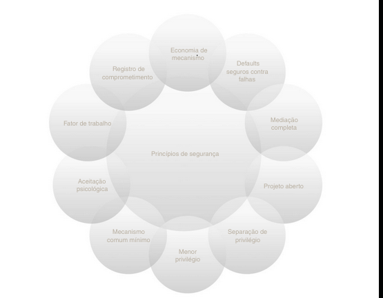

# Termos e Conceitos

## Ativo
- Tudo que tem valor para uma organização é um ativo para segurança da informação
    - Ex: Funcionários, Dados e informações, Bens físicos, Domínios
    - Segurança da informação não se trata apenas de cybersecurity

## Vulnerabilidade
- Fraqueza de um ativo, que pode se dar por uma má constituição ou uso

## Ameaça
- Tudo que pode impactar negativamente a organização

## Incidente
- Quando a vulnerabilidade é explorada
    - Ex: ataque DDOS

## Impacto
- Forma de medir oque um incidente causará para a organização
    - Depende do contexto da empresa/sistema afetados

### Perguntas a serem feitas para medir o impacto
- Causaria constragimento a alguém (terceiro, colaborador, instituição) ?
- O quanto atrapalharia a operação da instituição?
- Qual o custo ao negócio?
- A vulnerabilidade é fácil ou difícil de ser explorada?
    - Impacta na probabilidade de exploração da mesma
- Qual o custo para consertar?

### Níveis de impacto
- Varia de empresa para empresa
    - Muito baixo, baixo, médio, alto, muito alto
    - Baixo, médio, alto
- Risco = probabilidade * o impacto causado
- O nível de impacto pode variar de acordo com fatores externos, como por exemplo, uma campanha de marketing trazendo visibilidade para o negócio

## Qual o motivo para conhecer as vulnerabilidades?
**Conhecer as vulnerabilidades nos ajuda a saber onde investir**
**Conhecer as vulnerabilidades nos ajuda a saber nossos pontos fracos**
**Conhecer as vulnerabilidades nos ajuda a melhorar a eficiência do negócio**

## Regras da segurança da informação (Relembrar é viver)

- Princípio do menor acesso (Segregação de função e acesso)
    - Somente o menor acesso ofertado para o acesso aos recursos
- A segurança é tão forte quanto seu elo mais fraco
    - Se um dos processos for fraco a chance de exploração é alta
- Todo acesso/envio de dados é mal intencionado até que se prove o contrário
    - Validações ineficazes, por exemplo
- Dividir para conquistar
    - Quando divído eu pratico o princípio do menor acesso

## Pilares da segurança da informação

- Confidencialidade
    - Tornar confidencial uma informação que tem um público seleto, restrito
- Integridade
    - Alterações feitas no documento precisam ser feitas por quem pode fazê-las apenas
- Disponibilidade
    - Estar acessível ao público destinado
- Conformidade
    - Legislações internas e externas
- Não-repúdio
    - Toda ação executada deve inibir a ação de negação por parte do usuário (logs, por exemplo)
- Autenticidade
    - Colabora com integridade e não repúdio

### Confidencialidade
    - Encriptação
    - Controle de acesso
        - Regras e políticas que limitam o acesso a informação confidencial apenas para pessoas ou sistemas com a necessidade de saber. Essa necessidade é baseada em alguma identificação referente ao elemento, como um papel desempenhado, nome ou número serial de uma máquina, por exemplo
    - Autenticação
        - A determinação da identidade ou do papel de alguém. Pode ser feita através da combinação de algo que a pessoa possui, como um dispositivo que armazena chaves secretas, algo que a pessoa sabe, como uma senha ou algo que a pessoa seja, como traços biométricos
    - Autorização
        - A determinação se uma pessoa ou sistema tem permissão para acessar os recursos solicitados, com base em uma política de controle
    - Segurança física

### Integridade
     - Comprometimento benigno
        - Uma alteração causada a um dispositivo físico, como um HD, que faz o mesmo perder/corromper seus dados
     - Compromentimento malicioso
        - Vírus que infecta rede

#### Ferramentas para apoiar a integridade
    - Cópias de segurança
        - Arquivamento periódico de dados
    - Somas de verificação (checksums)
         - Computação de função que mapeia o conteúdo do arquivo para um valor numérico. Depende do conteúdo completo do arquivo. São como detonadores para detectar uma ocorrência de brecha na integridade
    - Códigos de correção de dados
        - Métodos para armazenar dados de tal maneira que pequenas alterações podem ser facilmente detectadas e automaicametne corrigidas.

- As ferramentas acima tem em comum o uso de redundâncias
- Metadados também precisam ser protegidos
    - Usuário proprietário, última modificação, etc

### Disponibilidade
     - Proteções físicas
        - Infra projetada para manter a informação disponível mesmo na presença de desafios físicos.
    - Redundâncias computacionais
        - arrays de RAID

## Garantia, autenticidade e anonimato

 - Garantia
    - como a confiança é fornecida e gerenciada em sistemas
    - Envolve a interação dos seguintes: 
        - **Políticas**: Expectativas comportamentais que pessoas ou sistemas têm de si mesmas ou de outros. 
        - **Permissões**: Descrevem comportamentos permitidos pelos agentes que interagem com uma pessoa ou ssitema
        - **Proteções**: Descrevem mecanismos inseridos para assegurar permissões e políticas
## Autenticidade
 - É a habilidade de determinar que afirmaçoes, políticas e permissões de pessoas ou sistemas são genuínas
 - Assinaturas digitais são um bom exemplo de como garantir o não repúdio

## Anonimato
 - Ferramentas para preservação da privacidade:
    - Agregação: Combinação ded ados de muitos indivíduos de modo que a divulgação dessas somas ou médias não possas ser vinculada a qualquer indivíduo. Exemplo: Censo (IBGE)
    - Mistura: Entrelaçamento de transações, infos ou comunicações de modo que não possam ser rastreadas a nenhum indivíduo.
    - Representantes (proxies): Agentes de confiança que querem se engajar em ações para um indivíduo de maneira que não possam ser rastreados de volta para aquela pessoa.
    - Pseudônimos: Identidades ficcionais que podem servir como identidades reais em comunicações e transações, mas que são conhecidas apenas por entidades de confiança.

## Criptografia

- Escrita escondida
- Envolve chaves, conjuntos de valores matemáticos para embaralhar textos
    - Parte A e parte B
- Chaves
    - Simétrica e Assimétrica

### Chave simétrica
- Baixo custo computacional
- Mesmo meio
    - Ambas as partes ficam juntas

### Chave assimétrica
- Baseada em um par de chaves
    - Pública e privada
    - Ambas vinculadas
    - Quem abre a criptografia é a chave privada
- Alto custo computacional

### HTTPS
- Modelo híbrido, utiliza as duas formas

## OWASP
- É uma sigla para Open Web Application Security Project
- Documentos de categorias de vulnerabilidades
- Objetiva a conscientização
- Dividida em capítulos (Regionais)

### Top ten (2021)
- Quebra de acesso
- Falhas de criptografia
- Injeções
- Design inseguro
- Config incorreta
- Componentes vulneráveis e desatualizados
- Falhas de autenticidade
- Falha de integridade
- Falha no monitoramento ou insuficiência do mesmo
- Falsificação de request (SSRF)

### Ferramentas
- Dependency Check
- Dependency track monitor
    - Pode ser integrada com Pipelines
- Zed attack proxy
- Documentos

## Os dez príncipios de segurança

