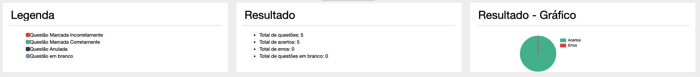

# Pós Graduação em Arquitetura de Software, Cybersecurity e Ciência de dados

 

Nesse repositório será possível encontrar todas minhas anotações e conteúdos relevantes perante o curso em questão, de acordo com as matérias das mesmas.

## Disciplinas

- (10/10/2023 - 31/10/2023) Cybersecurity: Conhecendo As Vulnerabilidades Da Aplicação
    - Professor referência: <a href="https://www.linkedin.com/in/izidio-rosa-22005424/?originalSubdomain=">Izidio Rosa</a>
- Resultado obtido na avaliação
