# Pós Graduação em Arquitetura de Software, Cybersecurity e Ciência de dados

 

Nesse repositório será possível encontrar todas minhas anotações e conteúdos relevantes perante o curso em questão, de acordo com as matérias das mesmas.

## Disciplinas

- (10/10/2023 - 31/10/2023) Cybersecurity: Conhecendo As Vulnerabilidades Da Aplicação
    - Professor referência: <a href="https://www.linkedin.com/in/izidio-rosa-22005424/?originalSubdomain=">Izidio Rosa</a>
- Resultado obtido na avaliação

- (01/11/2023 - 21/11/2023) Arquitetura Big Data: Como potencializar as análises e tomadas de decisões ágeis
    - Professor referência: <a href="https://www.youtube.com/@marcelocml1234">Marcelo Leite</a>
- Resultado obtido na avaliação
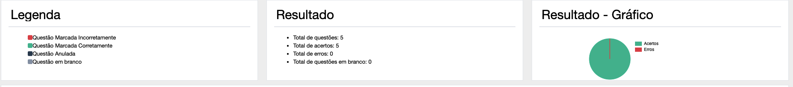

- (22/11/2023 - 12/12/2023) Inteligência moral na era digital
    - Professor referência: <a href="https://www.instagram.com/clovisdebarros/">Clóvis de Barros Filho</a>
- Resultado obtido na avaliação
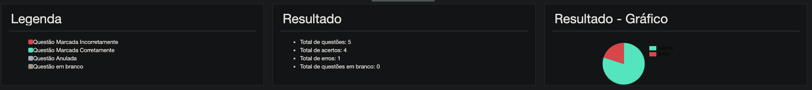

- (09/01/2024 - 30/01/2024) Soft skills para tomada de decisão 
    - Professor referência: <a href="https://www.instagram.com/danielhosken/">Daniel Hosken</a>
- Resultado obtido na avaliação 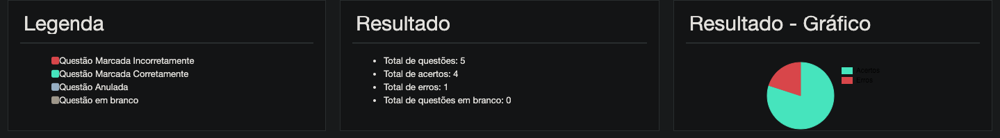

- (31/01/2024 - 21/02/2024) LGPD: Do privacy by design ao sistema legado
    - Professora referência: <a href="https://www.linkedin.com/in/patriciapeckpinheiro/?originalSubdomain=br">Patricia Peck</a>
- Resultado obtido na avaliação
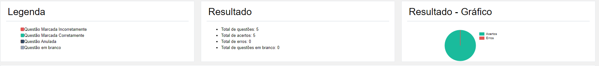

- (22/02/2024 - 12/03/2024) Multicloud
    - Professor referência: <a href="https://www.linkedin.com/in/rodrigovale/">Rodrigo Vale</a>
- Resultado obtido na avaliação
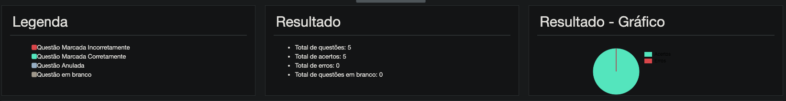

- (12/03/2024 - 02/04/2024) Migração Para Ambiente Em Cloud, Vale a Pena? Evitando a Estratégia De Lift And Shift
    - Professor referência: <a href="https://br.linkedin.com/in/roberto-prado-93051187">Roberto Prado</a>
- Resultado obtido na avaliação
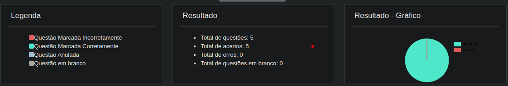

- (03/04/2024 - 23/04/2024) Serverless Computing
    - Professor referência:  <a href="https://www.linkedin.com/in/fernandosapata/?originalSubdomain=br">Fernando Sapata</a>
- Resultado obtido na avaliação
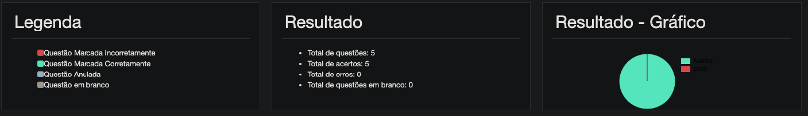

- (23/04/2024 - 14/05/2024) Mitigando Atritos Entre Times Utilizando Devsecops
    - Professor referência: <a href="https://www.linkedin.com/in/caiopereirasousa/">Caio Pereira</a>
- Resultado obtido na avaliação
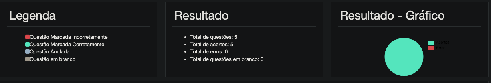

- (14/05/2024 - 04/06/2024) Projetando Arquitetura Com Segurança: Um Framework Para Proteger O Ciclo De Vida Do Software
    - Professor referência: <a href="https://yuridiogenes.wordpress.com/about/">Yuri Diogenes</a>
- Resultado obtido na avaliação
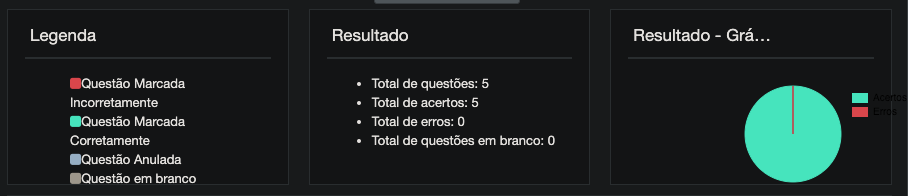

- (04/06/2024 - 25/06/2024) Ciência de Dados: Agile Data Science Escalável
    - Professor referência: <a href="https://www.linkedin.com/in/renatodmb/?originalSubdomain=br">Renato Barbosa</a>
- Resultado obtido na avaliação

- (25/06 a 16/07) Arquitetura de Microsserviços e Microcontainer
    - Professor referência <a href="https://www.linkedin.com/in/giovanejr/">Giovane Moura</a>
- Resultado obtido na avaliação
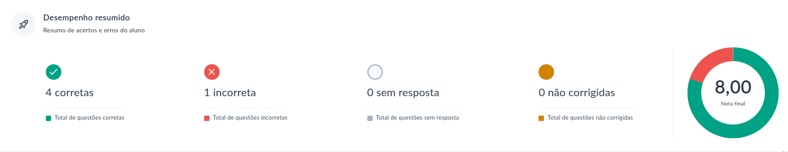

- (06/08 a 27/08) Devops
    - Professor referência <a href="https://www.linkedin.com/in/analiairigoyen/?locale=pt_BR">Analia Irigoyen</a>
- Resultado obtido na avaliação
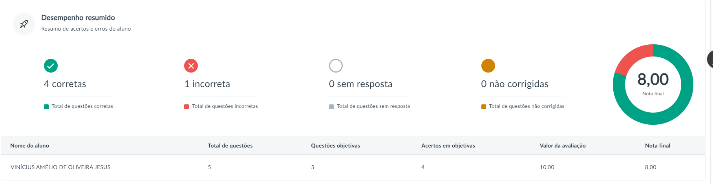

- (27/08 a 17/09) Padrões arquiteturais
    - Professor referência <a href="https://www.linkedin.com/in/psevestre/?originalSubdomain=br">Philippe Sevestre</a>
- Resultado obtido na avaliação
